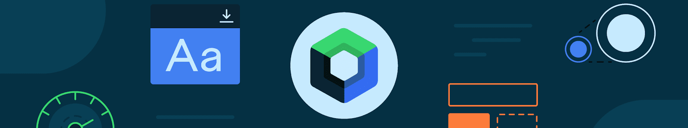

# Courses Android Compose Basic - Solution Code #AndroidBasics.

---

Solution code for the Android Basics with Compose: Task Manager

Exercise source: https://developer.android.com/codelabs/basic-android-kotlin-compose-composables-practice-problems?hl=es-419&continue=https%3A%2F%2Fdeveloper.android.com%2Fcourses%2Fpathways%2Fandroid-basics-compose-unit-1-pathway-3%3Fhl%3Des-419%23codelab-https%3A%2F%2Fdeveloper.android.com%2Fcodelabs%2Fbasic-android-kotlin-compose-composables-practice-problems#2

# Description

------------

## [3\. Administrador de tareas](https://developer.android.com/codelabs/basic-android-kotlin-compose-composables-practice-problems?hl=es-419&continue=https%3A%2F%2Fdeveloper.android.com%2Fcourses%2Fpathways%2Fandroid-basics-compose-unit-1-pathway-3%3Fhl%3Des-419%23codelab-https%3A%2F%2Fdeveloper.android.com%2Fcodelabs%2Fbasic-android-kotlin-compose-composables-practice-problems#2)

## 

La app del Administrador de tareas permite que los usuarios gestionen sus tareas diarias y verifiquen las que deben completar.

En este ejercicio, compilarás una pantalla que los usuarios verán cuando completen todas las tareas de un día determinado.

### Captura de pantalla final

## 

Cuando termines la implementación, tu diseño debería coincidir con esta captura de pantalla:

### Especificación de IU

## 

Sigue estas especificaciones de IU:

1.  Aplica una alineación central a todo el contenido en dirección vertical y horizontal en la pantalla.
2.  Configura el primer elemento `Text` que admite composición con un grosor de fuente `Bold`, un padding superior de `24dp` y un padding inferior de `8dp`.
3.  Configura el segundo elemento `Text` componible con un tamaño de fuente `16sp`.

### Recursos

## 

[Esta imagen](https://github.com/google-developer-training/basic-android-kotlin-compose-training-practice-problems/blob/main/Unit%201/Pathway%203/TaskCompleted/app/src/main/res/drawable/ic_task_completed.png), que debes descargar e importar a tu proyecto, además de las siguientes cadenas:

-   `All tasks completed`
-   `Nice work!`